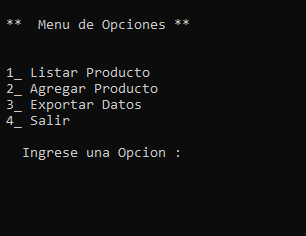
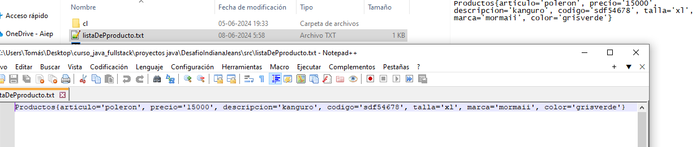

Desafío - Tienda IndianaJeans
--

En este desafío validaremos nuestros conocimientos vistos en las sesiones anteriores.

Lee todo el documento antes de comenzar el desarrollo individual o grupal, para asegurarte
de tener el máximo de puntaje y enfocar bien los esfuerzos.
Requerimientos

La tienda “Indiana Jeans” necesita actualizar su sistema de ventas. Los productos ofrecidos
son Jeans, Poleras y Polerones, sin embargo, la tienda busca contar con una aplicación para
agregar nuevos productos y listarlos. Es por esto, que le solicitan los siguientes
requerimientos: 

1) Crear la clase Producto con los siguientes parámetros:
   (2 Puntos)
- String articulo.
- String precio.
- String descripcion.
- String codigo.
- String talla.
- String marca.
- String color.

2) Generar los getters y setters correspondientes en la clase Producto y el método
   toString.
   (1 Punto)

3) Generar una clase ProductoServicio que contendrá una ArrayList llamada
   listaProductos, con su respectivo getters y setters. Además, esta clase debe contar
   con los siguientes métodos con sus respectivas aplicaciones:
   (2 Puntos)
- listarProductos.
- agregarProductos
4) Crear la clase abstracta Exportador con el método abstracto exportar. Esta pueda ser
   extendida por la clase ExportarTxt.
   (1 Punto)

5) Crear la clase ExportadorTxt extendido por herencia de la clase ExportarTxt.
      Utilizamos el método exportar y generamos aquellos códigos que nos ayuden a
      exportar la lista de productos en un archivo “.txt”.
      (1 Punto)

6) Crear una clase Menu que contendrá un menú similar al que vemos a continuación,
   recordar que debemos generar todas las instancias de scanner en esta clase.
   (1 Punto)

        1 Listar Producto
        2 Agregar Producto
        3 Exportar Datos
        4 Salir
        Ingrese una opción:

7) Crear una clase Utilidad para usar métodos de limpieza de pantalla y tiempo de
   espera.
   (2 Puntos)

- Caso: Agregar producto

        1 Listar Producto
        2 Agregar Producto
        3 Exportar Datos
        4 Salir
        Ingrese una opción:
        2
        Crear Producto
        Ingresar nombre articulo:
        Jean
        Ingresa precio:
        15000
        Ingresa descripción:
        Es un Jean muy lindo con hermosos detalles
        Ingresa código:
        1500
        Ingresa talla:
        42
        Ingresa marca:
        Levis
        Ingresa color:
        Azul Marino

Imagenes del Proyecto

